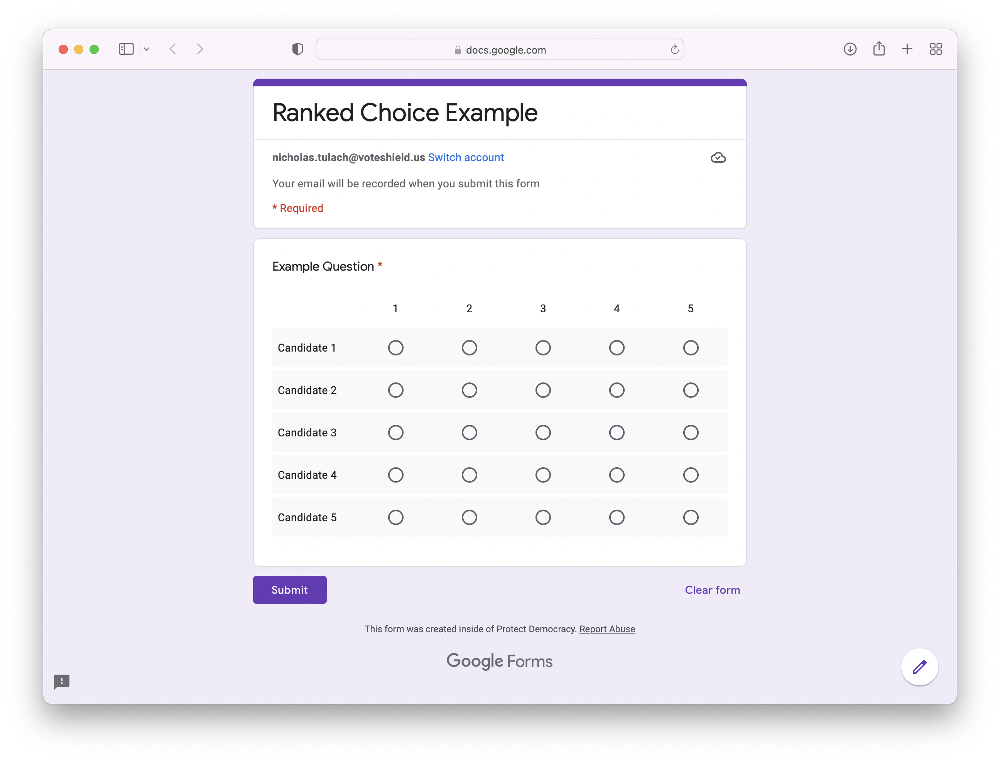

# Ranked Choice Scorer

**Description**: A Python script that scores ranked choice results from Google Forms.

**Screenshots**: 

## Dependencies

1. Python 3.9 or greater
2. [Poetry](https://python-poetry.org) 1.1 or greater
3. Google Form results spreadsheet with at least one Multiple Choice Grid question you want scored.
4. Google Sheets API access and credentials. See [Google Developer documentation](https://developers.google.com/workspace/guides/create-credentials#oauth-client-id) for details on setting up "Desktop App" access.

## Installation

1. Clone the repository.
2. From the base project directory, run `poetry install`
3. Run `poetry shell`
4. Run `python ranked_choice_scorer.py --help` for a list of options

## Usage

The command line tool has three options available:

1. `--googleid`: The Google Sheet ID of the spreadsheet you want to process
2. `--questions`: The exact text string of the questions you want to process (supports multiple space-separated strings)
3. `--chart`: A flag to include Sankey diagrams of the results

## Getting help

If you have questions, concerns, bug reports, etc, please file an issue in this repository's Issue Tracker.

----

## Open source licensing info
1. [TERMS](TERMS.md)
2. [LICENSE](LICENSE)
3. [Protect Democracy Source Code Policy](https://github.com/Protect-Democracy/source-code-policy/)

----

## Credits and references

1. [Ricardo Rosas's Medium post](https://rrosasl.medium.com/ranked-choice-voting-with-google-forms-and-python-c471ea568a60) was used as a basis for this project and we owe them a debt of gratitude for sharing their solution.
2. [This Toward Data Science article](https://towardsdatascience.com/sankey-diagram-basics-with-pythons-plotly-7a13d557401a) was helpful in understanding some of the nuances of Plotly's Sankey implementation.
